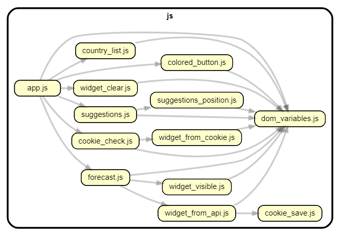
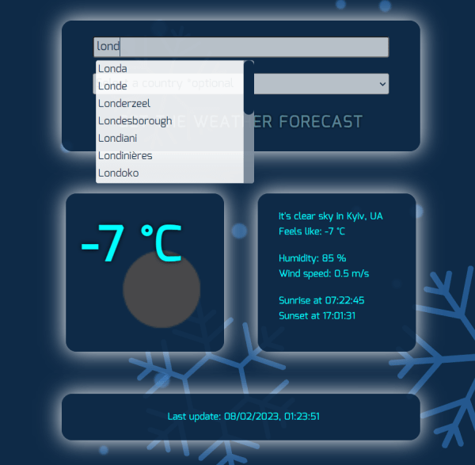

# Get Weather App

Weather forecast with search by city name and country using [ISO 3166 Regional Codes.](https://github.com/lukes/ISO-3166-Countries-with-Regional-Codes)

Search by city is implemented with suggestions of options when the user enters the name. Data is stored in external json files. 

Synchronization between selected city and the countries corresponding to the choice has been implemented.

Fetch requests to the [openweathermap](https://openweathermap.org/api) api are used.

Forecast data is stored and displayed with cookies.

After 10 minutes fresh data is requested.

 
